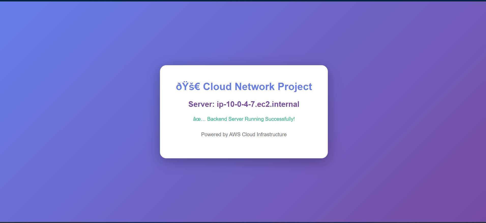

# Cloud-based Networking for Facebook-class Webapps/Backends

A Computer Networks project simulating a scaled, secure cloud backend
infrastructure — modeled on how large-scale platforms like Facebook
structure their networking layer — built entirely on AWS.

> 📄 Full report: [`/documentation/project_report.pdf`](./documentation/project_report.pdf)
> 📝 Build notes: [`notes.txt`](./Notes.txt)

---

##  Live Demo

<!-- PASTE SCREENSHOT HERE: Screenshots/Phase3-EC2/07-App-Working.png -->
<!-- (or your updated Facebook-style UI screenshot if you retook it) -->


The application is a simple Node.js backend deployed across multiple
EC2 instances behind a load balancer, showing live server metrics and
proving load distribution on refresh.

---

## 🏗️ Architecture

<!-- PASTE SCREENSHOT/EXPORT HERE: Diagrams/architecture-diagram.png -->
<!-- (export of the Mermaid diagram, or your draw.io diagram) -->


```
Internet
   ↓
CloudFront (CDN, HTTPS)
   ↓
Application Load Balancer  (Public Subnets)
   ↓
Auto Scaling Group → EC2 Instances  (Private Subnets)
   ↓
CloudWatch (Monitoring, Alarms, Flow Logs)


## 📦 What's Inside

| Component | Details |
|---|---|
| **VPC** | `10.0.0.0/16`, 4 subnets across 2 Availability Zones |
| **Compute** | EC2 t3.micro instances, Auto Scaling (min:1, desired:2, max:4) |
| **Load Balancing** | Application Load Balancer with health checks |
| **Security** | Security Groups + Network ACLs (defense-in-depth), VPC Flow Logs |
| **CDN** | CloudFront distribution, HTTPS enforced, edge caching |
| **Monitoring** | CloudWatch dashboard, 3 alarms, Log Insights queries |

---

## 📊 Monitoring Dashboard

<!-- PASTE SCREENSHOT HERE: Screenshots/Phase6-Monitoring/03-Complete-Dashboard.png -->


---

## 📁 Repository Structure

```
.
├── README.md                     ← you are here
├── notes.txt                     ← running build notes
├── Documentation/
│   └── report.md                 ← full written report (all 6 phases)
├── Diagrams/
│   └── architecture_diagram.png  ← exported image version
├── Code/
│   └── app.js                    ← Node.js backend application
└── Screenshots/
    ├── Phase1-Setup/
    ├── Phase2-VPC/
    ├── Phase3-EC2/
    ├── Phase4-Security/
    ├── Phase5-DNS-CDN/
    └── Phase6-Monitoring/
```

Every screenshot referenced in the report lives in its matching
`Screenshots/PhaseX-.../` folder — the report and this README only
embed a few key ones inline for a quick visual overview.

---

## 🛠️ Tech Stack

- **Cloud:** AWS (VPC, EC2, ALB, Auto Scaling, CloudFront, CloudWatch, IAM)
- **Backend:** Node.js
- **Networking:** Security Groups, NACLs, Route Tables, NAT/Internet Gateway
- **Docs/Diagrams:** Markdown, Mermaid

---

## 👥 Team

| Name | Phases Owned |
|---|---|
| Ibad Ur Rehman | Phase 1–2: Setup & Networking (VPC, Subnets, Gateways, Routing) |
| Aaqib Zahid | Phase 3–4: Compute & Security (EC2, ALB, Auto Scaling, SGs/NACLs) |
| Muhammad Mustafa | Phase 5–6: CDN & Monitoring (CloudFront, CloudWatch) |

---

## ⚠️ Notes

- This project uses AWS Free Tier resources where possible; see
  `Documentation/report.md` § Cost Summary for an estimate.
- No `.pem` key files or credentials are committed to this repository.
- AWS WAF was intentionally not enabled to stay within Free Tier cost
  bounds — see report § Security Architecture for the reasoning.

---

## 📄 License

Academic project — Computer Networks coursework. Not intended for
production use without further hardening (e.g., adding a database tier,
custom domain, CI/CD, and WAF).
